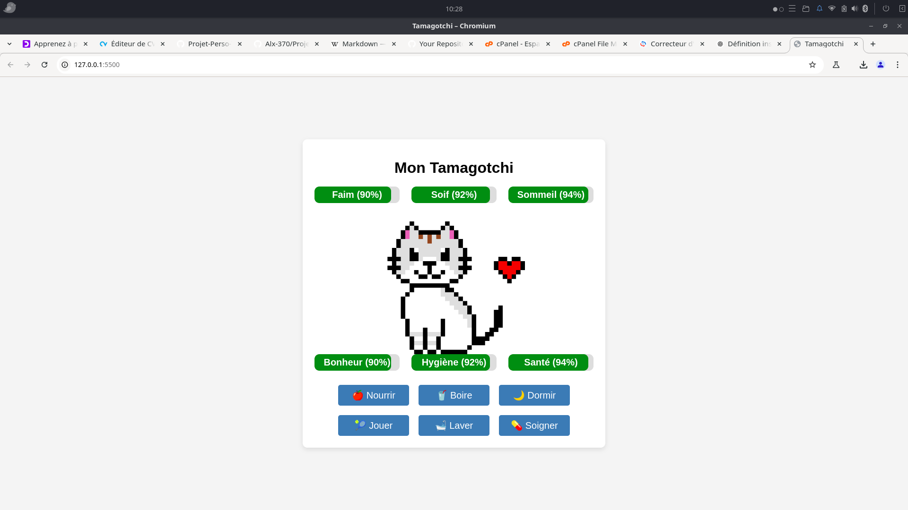

# Projet Tamagotchi Version 2.0

Mini Projet : Mon Tamagotchi Virtuel
Bienvenue dans mon petit projet personnel ! J’ai commencé à développer une version simplifiée d’un Tamagotchi — ce petit animal virtuel qu’on aimait tant dans les années 90/2000. L’idée : créer un compagnon numérique avec lequel on peut interagir, le nourrir, jouer avec lui et veiller à son bien-être.  

  Ce projet est encore en cours de développement, mais il intègre déjà quelques fonctionnalités de base comme :

  -Suivi de l’humeur et de l’énergie,

  -Actions disponibles : nourrir, jouer, dormir,

  -Réactions dynamiques selon l’état du Tamagotchi.
 

 Création de GIF en utilisant Pixel Brush.  

 Envie d'essayer?
 https://alx-370.github.io/Projet-Perso-TamagotchiV2/  

Ouvrir en premier le fichier index.html

## 🛠️Compérences :

## 🔗Liens :

